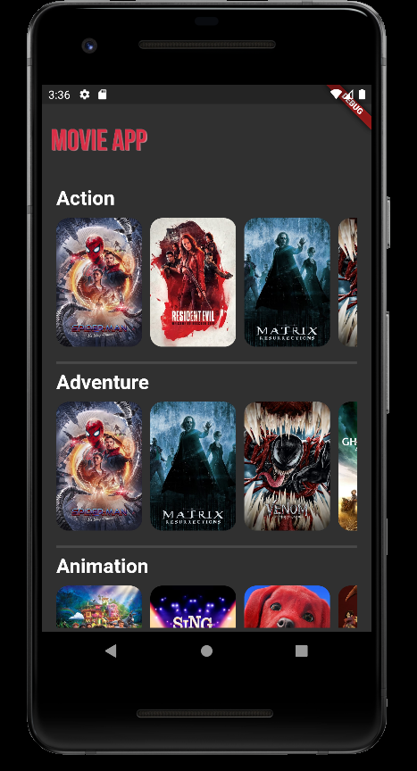
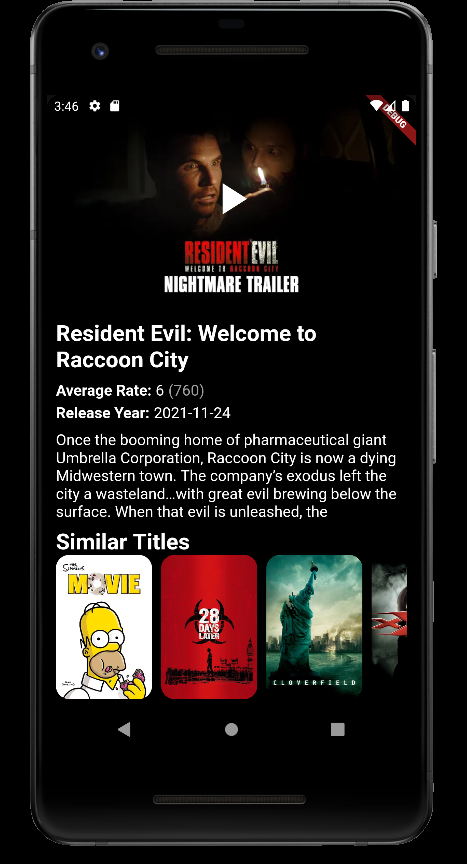
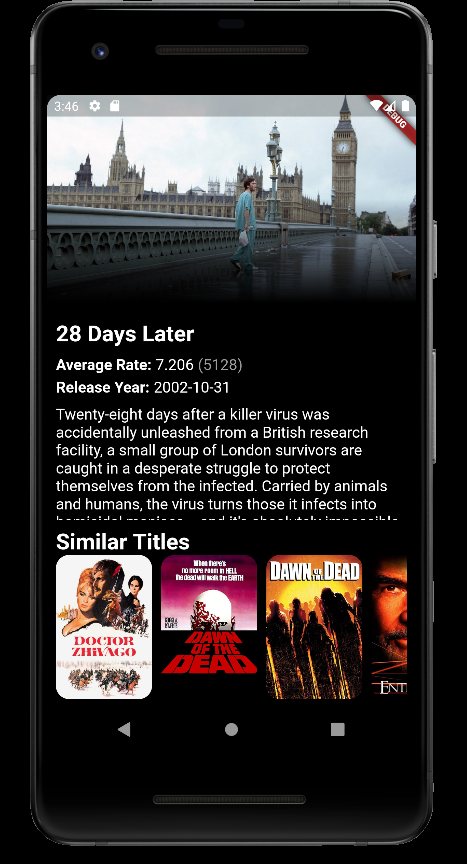

The MovieApp is a mobile application demo project inspired in the Netflix app. This project uses an open-source database TMBD which contains thousands of movies and series added by its users.

---

**Framework Used:** [Flutter](https://flutter.dev/) (Google's Dart based framework)

**Database API:** [TMBD API](https://developers.themoviedb.org/3/getting-started/introduction)

---

## Implemented Features:

### Home Screen
In the first screen we can see a list of different movie genres, each of these genre sections has another horizontal list showing the movies belonging to that genre.

### Movie Details
When clicking in a movie image in the Home Screen, a modal opens showing some details for this movie.

The first thing is the trailer for the movie, but only if the link for the official trailer in youtube was available. When this doesn't happen this area will show a backdrop for the movie instead of the trailer.

The informations shown, if available on the database, are:
- Average Rate (Number of votes)
- Release Date
- Movie Description
- Similar Titles

Trailer          |  No Trailer
:-------------------------:|:-------------------------:
  |  

## Demo

See app video demo in [here](https://github.com/MargaridaMorais/MovieApp/blob/develop/Assets/video_demo.mp4).